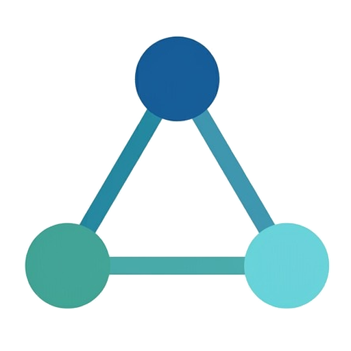

<h1>
  
  TRIAD
</h1>

**Trusted RDF Interoperable Agent Data**

CSC 501; Algorithms and Data Models (Fall 2026), Prof. Hossein Fani
University of Victoria

A data model for clinical records created and revised by multiple people over
time: typed entities for patients, encounters and clinical assertions, with
explicit relationships for authorship and revision, so the current state is
reached by traversal rather than by search. Clinical entities are modelled
against the HL7 FHIR standard.

## Team

- Asish George
- Mohamed Khaled

## Repository layout

```
proposal/     Milestone 1 — project definition (LaTeX source + compiled PDF)
assets/       Logo and figures
```

## Milestones

| # | Deliverable | Due |
|---|-------------|-----|
| 1 | Project definition and team formation | Sep 23 |
| 2 | Background and related work | Oct 7 |
| 3 | 3MT proposal presentation | Oct 15 |
| 4 | Solution design and implementation | Nov 4 |
| 5 | Evaluation | Nov 18 |
| 6 | 10MT demo | Nov 26 |
