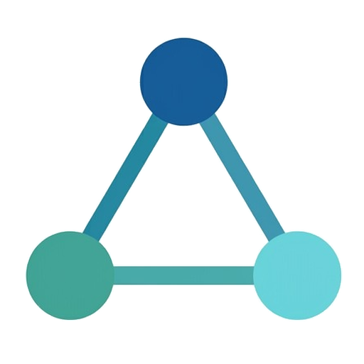
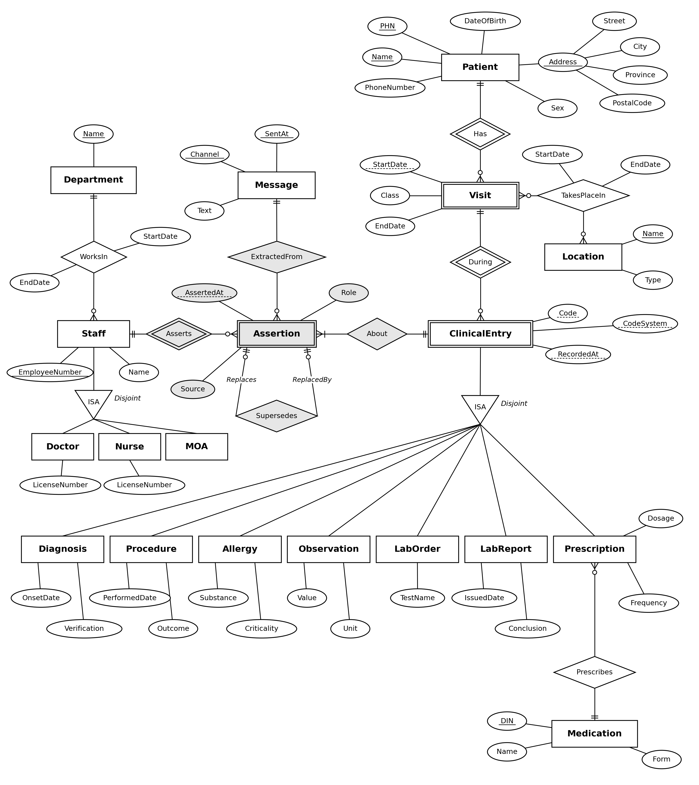

<h1>
  
  TRIAD
</h1>

**Trusted RDF Interoperable Agent Data**

CSC 501; Algorithms and Data Models (Fall 2026), Prof. Hossein Fani
University of Victoria

A data model for clinical records created and revised by multiple people over
time: typed entities for patients, encounters and clinical assertions, with
explicit relationships for authorship and revision, so the current state is
reached by traversal rather than by search. Clinical entities are modelled
against the HL7 FHIR standard.

## Draft data model

Every clinical entry is linked to an **Assertion** that records who asserted it,
in what role, when, and from which message. A unary **Supersedes** relationship
records what replaced what, so the current version is the one that nothing
supersedes. Grey marks where TRIAD's novelty concentrates; white entities take
their names from FHIR R4.



The editable draw.io sources are in [`assets/designing_erd/`](assets/designing_erd/).

## Team

- Asish George
- Mohamed Khaled

## Repository layout

```
proposal/                     Milestone 1: project definition (LaTeX source + compiled PDF)
background_and_related_work/  Milestone 2: background, related work and draft ERD (LaTeX source + compiled PDF)
assets/figures/               Figures used in the reports
assets/designing_erd/         ERD draw.io sources and data-model documentation
assets/                       Logo and icon
```

## Milestones

| # | Deliverable | Due | Report |
|---|-------------|-----|--------|
| 1 | Project definition and team formation | Sep 23 | [PDF](proposal/TRIAD_Proposal.pdf) |
| 2 | Background and related work | Oct 7 | [PDF](background_and_related_work/02_Background.pdf) |
| 3 | 3MT proposal presentation | Oct 15 | |
| 4 | Solution design and implementation | Nov 4 | |
| 5 | Evaluation | Nov 18 | |
| 6 | 10MT demo | Nov 26 | |
